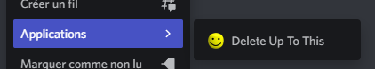

# UTSUKUSHI BOT (Discord-Bot)

Discord Bot for my private Discord Server & friends server.

## Dependency
- **[@Discordjs/voice](https://www.npmjs.com/package/@discordjs/voice)** : 0.16.0       # Manage Voice Channel Connection and Audio Player
- **[@distube/ytdl-core](https://www.npmjs.com/package/@distube/ytdl-core)** : 4.11.8   # Youtube Downloader
- **[Axios](https://www.npmjs.com/package/axios)** : 0.27.2                             # Http Requests
- **[Discord.js](https://www.npmjs.com/package/discord.js)** : 14.9.0                   # Discord API
- **[Dotenv](https://www.npmjs.com/package/dotenv)** : 16.0.1                           # Manage Environments Variables
- **[Staticmaps](https://www.npmjs.com/package/staticmaps)** : 1.10.0                   # Get Static Map Images
- **[Ytsr](https://www.npmjs.com/package/ytsr)** : 3.8.0                                # Youtube Search Service

## Installation

1. Clone projet : `git clone https://github.com/DRACOX2500/Discord-Bot.git`

2. Install / Update packages manager  
   - Install **NodeJS** latest LTS version (*current : 18.15.0*)
   - Install / Update **NPM** : `npm i -g npm@<latest-version>` (*current 9.6.4*)
   - *Only Linux* : `apt install libtool` 

3. Install dependencies
   - Execute following command : `npm i`
   - Install TypeScript & TypeScriptPath (Global) : `npm i -g typescript tspath`
   - If an **Opus error** is returned, try to remone project directory and reclone project

4. Environment Variables
   - Copy or Rename `.env.example` into `.env`
   - Complete the *.env file* with your values

5. Start Utsukushi Project
   - Build : `npm run build`
   - Start : `npm start`
   - Build + Start : `npm restart`

## Interaction

### Slash Commands

Status : 
   - ✅ stable
   - 🧪 experimental
   - ❌ deprecated
   - 💀 deleted

|              **Name**              | **Description**                                                                                                                                                                                                                       | **Permission** | **DM** |       **status**       |
|:----------------------------------:|:--------------------------------------------------------------------------------------------------------------------------------------------------------------------------------------------------------------------------------------|:--------------:|:------:|:----------------------:|
|            /big-burger             | Return a random burger picture                                                                                                                                                                                                        |      _No_      |   ✅    |  [💀](# "deleted")   |
|   [⭐](# "New") /bot activity    | Set Utsukushi activity, Select activity type :   Play, Listen, Stream, Competing, Watch   And Enter an activity message                                                                                                         |      _No_      |   ✅    |    [✅](# "stable")     |
|    [⭐](# "New") /bot status     | Set Utsukushi status :   Online, Idle, Do not Disturb, Invisible                                                                                                                                                                   |      _No_      |   ✅    |    [✅](# "stable")     |
|     [✨](# "Update") /cache      | Manage your cache in Utsukushi Database :  - Delete: delete all your data in Utsukushi database - Show: Utsukushi sends you your data in DM                                                                                     |      _No_      |   ✅    |    [✅](# "stable")     |
|               /fuel                | (Only for france - Governmental API)  Search fuel data (Address, Services, Updated Date, Fuel Cost, City, Department, Region) map include !                                                                                        |      _No_      |   ✅    |    [✅](# "stable")     |
|                /git                | Return Utsukushi Bot Github Repo                                                                                                                                                                                                      |      _No_      |   ✅    |    [✅](# "stable")     |
|       [⭐](# "New") /guild       | Return Guild information (Created At, Joined At, Member Count, Booster Count, Locale, Emojis, Stickers, Roles, Banned Users)                                                                                                          |      _No_      |   ❌    |    [✅](# "stable")     |
| [⭐](# "New") /guild-share-emoji | Authorize the guild to share emojis with Utsukushi and other guild                                                                                                                                                                    |  ManageGuild   |   ❌    |    [✅](# "stable")     |
|      [⭐](# "New") /locale       | Change the local language of your guild                                                                                                                                                                                               |  ManageGuild   |   ❌    |    [✅](# "stable")     |
|     [⭐](# "New") /notify on     | Choose a channel to notify when someone connects to a voice channel                                                                                                                                                                   |  ManageGuild   |   ❌    |    [✅](# "stable")     |
|    [⭐](# "New") /notify off     | Disable notify system                                                                                                                                                                                                                 |  ManageGuild   |   ❌    |    [✅](# "stable")     |
|               /ping                | 🤖 All bots started like this (Historic Command)                                                                                                                                                                                      |      _No_      |   ✅    |    [✅](# "stable")     |
|      [✨](# "Update") /play      | Play a music in voice channel, By default, plays the last music played (You can manage music with embed & buttons).  Search the music by keywords or YouTube URL, The keywords will be saved in the database and can be used later |      _No_      |   ❌    | [🧪](# "experimental") |
|   [⭐](# "New") /play-together   | Start a Discord Activity in voice Channel                                                                                                                                                                                             |      _No_      |   ❌    |  [💀](# "delete")   |
| [⭐](# "New") /soundeffect play  | Play sound effect in voice channel                                                                                                                                                                                                    |      _No_      |   ❌    |    [✅](# "stable")     |
|  [⭐](# "New") /soundeffect add  | Add sound effect in Utsukushi Database (30sec max only)                                                                                                                                                                               |      _No_      |   ❌    |    [✅](# "stable")     |
|   [⭐](# "New") /speak-as-bot    | Send a message as bot (attachment available)                                                                                                                                                                                          |      _No_      |   ✅    |    [✅](# "stable")     |

More slash command details available in **[Commands.md](./docs/commands.md)**

### Context Menus

#### What is a context menu ?

*"Context Menus are application commands which appear when right-clicking or tapping a user or a message, in the Apps submenu."*

source: [discordjs.guide](https://discordjs.guide/interactions/context-menus.html)

Status :
- ✅ stable
- 🧪 experimental
- ❌ deprecated
- 💀 deleted

|           **Name**           | **Description**                                                                                                                                                | **Permission** | **DM** |       **status**       |
|:----------------------------:|:---------------------------------------------------------------------------------------------------------------------------------------------------------------|:--------------:|:------:|:----------------------:|
|      Delete Up To This       | Select a message, right click and select this options to delete all messages until selected message (selected message include)  | ManageMessages |   ✅    |    [✅](# "stable")     |
| [⭐](# "New") React As Bot | Use the Utsukushi Emoji database to react to a message.                                                                                                        |      _No_      |   ✅    |    [✅](# "stable")     |
| [⭐](# "New") Reply As Bot | Reply to a message as Utsukushi Bot                                                                                                                            |      _No_      |   ✅    | [🧪](# "experimental") |

## CI

Continious Integration with [SonarCloud](https://sonarcloud.io/) !

