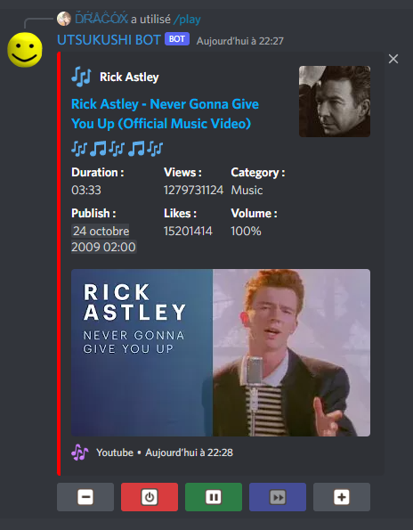

# Discord-Bot

My first Discord Bot for my private Discord Server & friends server.

## Dependency
- **[Axios](https://www.npmjs.com/package/axios)** : 0.27.2                             # Http Requests
- **[Discord.js](https://www.npmjs.com/package/discord.js)** : 14.3.0                   # Discord API
- **[Dotenv](https://www.npmjs.com/package/dotenv)** : 16.0.1                           # Manage Environments Variables
- **[@Discordjs/voice](https://www.npmjs.com/package/@discordjs/voice)** : 0.11.0       # Manage Voice Channel Connection and Audio Player
- **[@distube/ytdl-core](https://www.npmjs.com/package/@distube/ytdl-core)** : 4.11.1                     # Youtube Downloader
- **[ytsr](https://www.npmjs.com/package/ytsr)** : 3.8.0                                # Youtube Search Service

## Command

### **/big-burger**: generate a random burger picture.
### **/git**: get the URL GitHub repo
### **/snoring**: bot come in your voice channel and snores very loudly
### **/play *song:url_or_keywords***: search music by URL or Keywords and play it in your voice channel

*Embed inspired from [Scathach Bot](https://github.com/sinkaroid/scathachhh) !*

Buttons menu :

- **Volume up**: Increase audio player volume
- **Stop**: Stops the audio player
- **Pause/Resume**: Pause or Resume audio player
- **Skip**: ❌ Disabled
- **Volume Down**: Lower the volume of the audio player

### **/activity *type: activity_type* *status: text***: change bot activity
     PLAYING / LISTENING / STREAMING / COMPETING / WATCHING

## CI

Continious Integration with [SonarCloud](https://sonarcloud.io/) !

