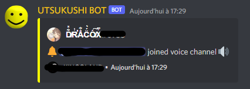

# UTSUKUSHI BOT COMMANDS

### **/ping**: get pong information
**1.1.0 NEW**: Now, response with Embed and more data !

\* *this image is a screenshot in dev version and my connection is really bad*

\* *In prod version, UTSUKUSHI has **100Go/s**, so if the color is yellow or red it's you*

- Pong data + Web Socket connection

- Color : 
     - Green = pong < 500ms
     - Yellow = pong > 500ms and pong < 750ms
     - Red = pong > 750ms

### **/git**: get the URL GitHub repo
### **/big-burger**: generate a random burger picture.
### **/snoring**: bot come in your voice channel and snores very loudly
### **/play *song:url_or_keywords***: search music by URL or Keywords and play it in your voice channel

*Embed inspired from [Scathach Bot](https://github.com/sinkaroid/scathachhh) !*

**1.1.0 NEW**:  
- Now, Autocompletion when you choose your favorite music !
- Increased sound quality !
- Optimisation Options Available ( *! volume control off !* )

Buttons menu :

- **Volume up**: Increase audio player volume
- **Stop**: Stops the audio player
- **Pause/Resume**: Pause or Resume audio player
     - **1.1.0 NEW**: You can click on the button when there is no player to play the music from the message !
- **Skip**: ❌ Disabled
- **Volume Down**: Lower the volume of the audio player

### **/activity *type: activity_type* *status: text***: change bot activity
>         activity_type: PLAYING / LISTENING / STREAMING / COMPETING / WATCHING

## v1.1.0 Commands

### **/cache *action: cache_action***: manage your user data
>         cache_action: CLEAR

### **/notify *channel: channel_name***: choose a channel, and UTSUKUSHI will notify you when someone enters a voice channel

### **/fuel *fuel: fuel_type search: search_method value: search_value***: (Only French Data) search fuel cost by search method and fuel type
>         fuel_type: GAZOLE / SP98 / SP95 / E85 / E10 / GPLc
>         search_method: Address / City / Commune / Dep Name / Dep Code / Region
